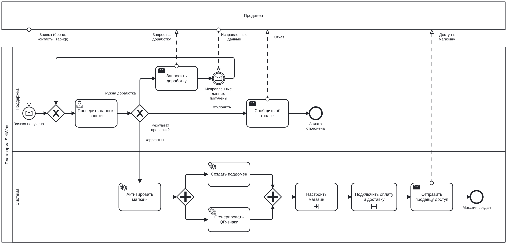
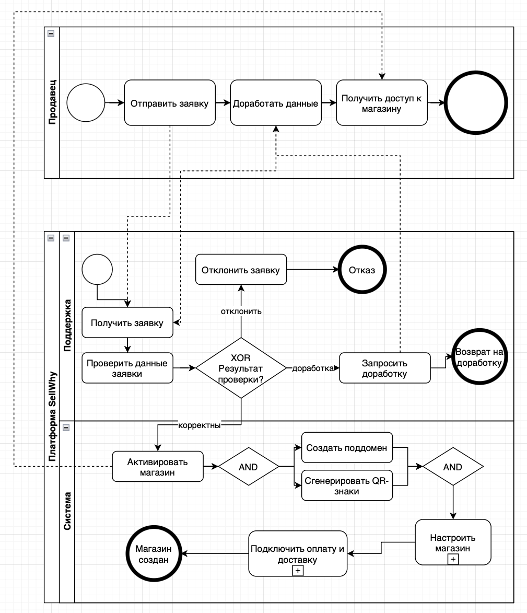
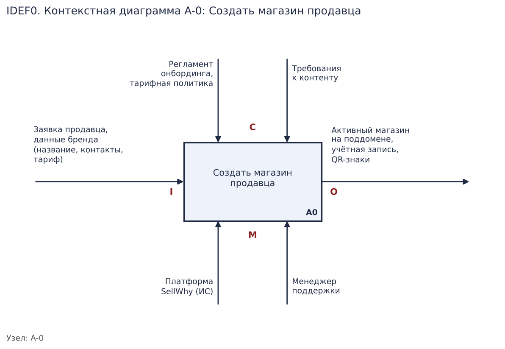
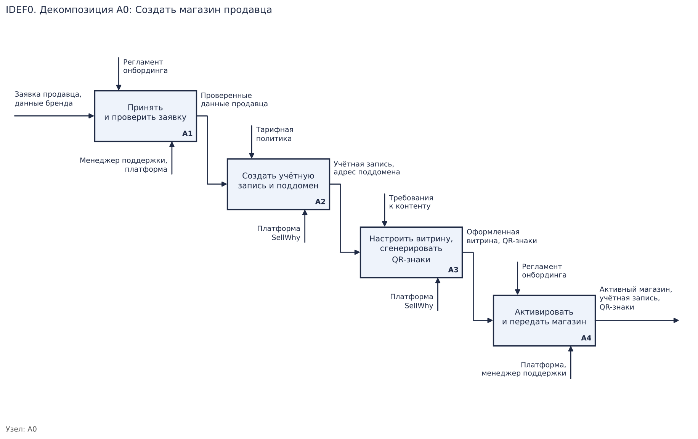
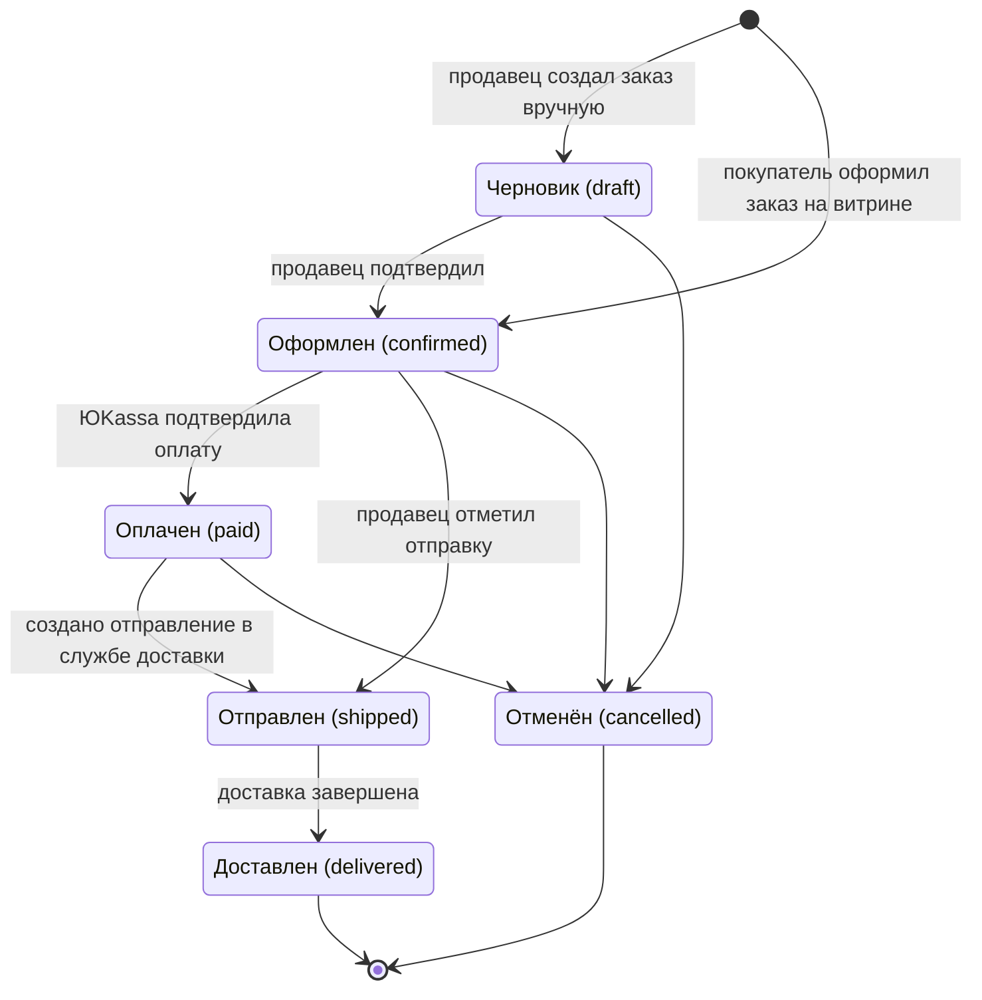
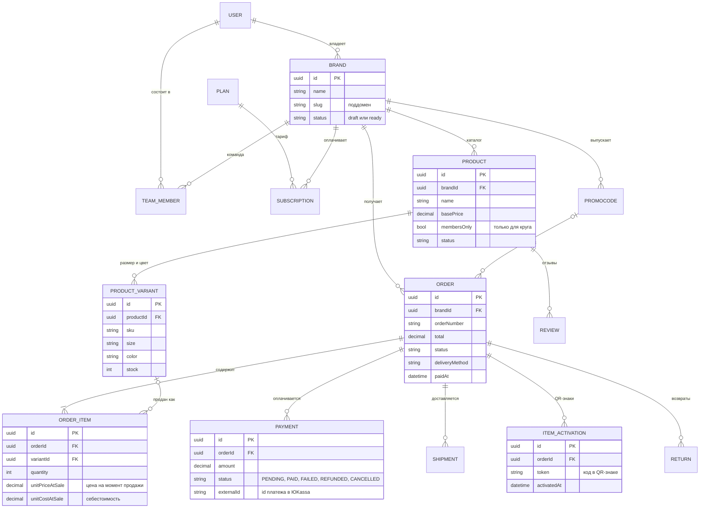
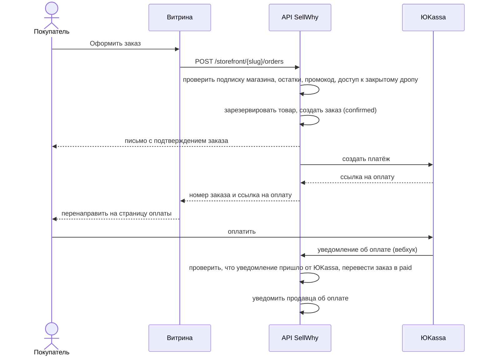
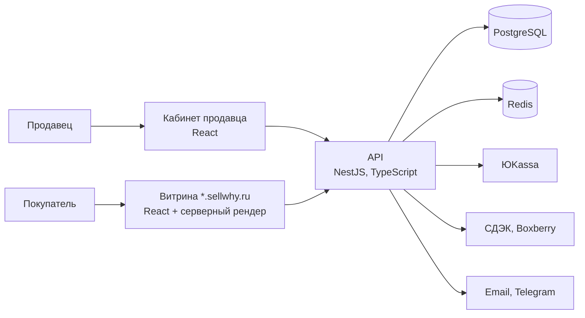

# Кейс: SellWhy

SellWhy ([sellwhy.ru](https://sellwhy.ru)) — SaaS-платформа, на которой предприниматель за несколько минут запускает интернет-магазин одежды без программирования.
Я спроектировал и разработал платформу (backend на NestJS и интерфейс на React), а затем в рамках учебной практики разобрал её процессы так, как это делает аналитик.

Этот кейс — об аналитической части: процессы, требования, модель данных и интеграции. Код платформы закрыт, поэтому всё описано здесь.

**Содержание**

1. [Контекст и участники](#1-контекст-и-участники)
2. [Процесс: регистрация продавца и создание магазина (BPMN)](#2-процесс-регистрация-продавца-и-создание-магазина)
3. [Функциональная модель (IDEF0)](#3-функциональная-модель-idef0)
4. [Жизненный цикл заказа](#4-жизненный-цикл-заказа)
5. [Расхождения, найденные при описании статусов](#5-расхождения-найденные-при-описании-статусов)
6. [Пользовательские истории и критерии приёмки](#6-пользовательские-истории-и-критерии-приёмки)
7. [Модель данных](#7-модель-данных)
8. [Оформление и оплата заказа: интеграция с ЮKassa](#8-оформление-и-оплата-заказа)
9. [Архитектура](#9-архитектура)
10. [Выводы](#10-выводы)

---

## 1. Контекст и участники

SellWhy работает как двусторонняя платформа: с одной стороны продавцы (бренды одежды), с другой — покупатели их магазинов.
Главная идея продукта — **знак принадлежности**: на каждой вещи есть уникальный QR-код.
Покупатель активирует его и попадает в «круг» бренда. Члены круга получают доступ к закрытым дропам и бонусам.

| Участник | Роль в процессах |
|---|---|
| Продавец (владелец бренда) | создаёт магазин, ведёт каталог, обрабатывает заказы |
| Покупатель | оформляет и оплачивает заказ, активирует QR-знак |
| Платформа (информационная система) | автоматические шаги: витрина, поддомен, QR-знаки, статусы, уведомления |
| Служба поддержки | проверяет заявки и помогает продавцам с настройкой |
| ЮKassa | приём оплаты от покупателей и оплата подписки продавцами |
| СДЭК, Boxberry | доставка заказов |

**Ключевые бизнес-процессы**

| № | Процесс | Триггер | Результат |
|---|---|---|---|
| 1 | Зарегистрировать продавца и создать магазин | продавец отправил заявку | активный магазин на поддомене |
| 2 | Наполнить каталог товаров | магазин создан | опубликованный каталог с QR-знаками |
| 3 | Оформить и обработать заказ | покупатель нажал «Оформить заказ» | заказ оплачен и передан в доставку |
| 4 | Провести оплату | покупатель перешёл к оплате | подтверждённый платёж |
| 5 | Сопровождать продавца | продавец обратился в поддержку | обращение решено |

Для моделирования выбран процесс 1. С него начинается жизненный цикл клиента платформы, и от него зависит, останется ли продавец.

## 2. Процесс: регистрация продавца и создание магазина



Исходник: [`seller-onboarding.bpmn`](seller-onboarding.bpmn), открывается в [bpmn.io](https://demo.bpmn.io) или Camunda Modeler.

**Как устроена модель**

- **Продавец — внешний участник**, поэтому его пул свёрнут («чёрный ящик»). Модель описывает процесс платформы, а с продавцом платформа общается только сообщениями.
- Процесс запускается **стартовым событием-сообщением** «Заявка получена».
- У проверки заявки три исхода: данные корректны, нужна доработка или заявка отклонена. Исходы разведены **исключающим шлюзом**.
- Доработка — это цикл: поддержка отправляет запрос и **ждёт исправленные данные** (промежуточное событие-сообщение), после чего проверяет заявку заново.
- Поддомен и QR-знаки создаются **параллельно** (И-шлюзы). Настройка магазина и подключение оплаты и доставки свёрнуты в **подпроцессы**.
- Дорожки разделяют ответственность: «Поддержка» — ручные шаги, «Система» — автоматические.

<details>
<summary>Первая версия схемы (с учебной практики) и что в ней исправлено</summary>



- Процесс платформы начинался обычным стартовым событием, хотя на самом деле его запускает заявка продавца. Теперь это стартовое событие-сообщение.
- «Возврат на доработку» был конечным событием, то есть процесс платформы на нём завершался, а исправленные данные приходили в середину уже законченного процесса. Теперь доработка оформлена циклом с ожиданием сообщения.
- У продавца шаг «Доработать данные» выполнялся всегда, даже если заявку сразу одобрили. Теперь продавец показан внешним участником, и этот путь задают сообщения от платформы.
- Шлюзы были подписаны текстом «XOR» и «AND» вместо стандартных значков. Теперь используются значки ✕ и +.

</details>

## 3. Функциональная модель (IDEF0)

Та же функция в нотации IDEF0: что поступает на вход, чем процесс управляется, кто его выполняет и что получается на выходе.





## 4. Жизненный цикл заказа

Статусная модель восстановлена по коду платформы. Это основа для требований к экранам заказов и уведомлениям.



| Переход | Кто или что инициирует | Условие |
|---|---|---|
| → confirmed | покупатель на витрине | у магазина активная подписка, товары в наличии, для закрытого дропа активирован знак бренда |
| draft → confirmed | продавец | только из черновика |
| confirmed → paid | вебхук ЮKassa | только из «Оформлен»; повторное уведомление ничего не меняет |
| → shipped | продавец или служба доставки | см. раздел 5 |
| shipped → delivered | продавец или статус от службы доставки | только из «Отправлен» |

## 5. Расхождения, найденные при описании статусов

Когда сводишь статусы в одну таблицу, видно, где правила расходятся. Здесь нашлись три таких места.

| # | Что обнаружено | Чем грозит | Рекомендация |
|---|---|---|---|
| 1 | Статус `confirmed` в разных экранах подписан по-разному: «Оформлен», «Подтверждён» и «Оплачен» | продавец видит «Оплачен» у заказа, деньги за который ещё не поступили | глоссарий статусов и одна подпись на статус во всём интерфейсе |
| 2 | Ручная отправка, в том числе массовая, разрешена только из `confirmed`. Заказ, оплаченный онлайн, получает `paid`, и отметить его отправленным вручную нельзя. Ошибка при этом звучит как «заказ не в статусе „Оплачен“» | продавец не может закрыть оплаченный заказ и получает сбивающее с толку сообщение | разрешить переход paid → shipped, а confirmed → shipped оставить только для оплаты при получении |
| 3 | При создании отправления в СДЭК или Boxberry заказ переводится в `shipped` без проверки текущего статуса | можно «отправить» отменённый или неоплаченный заказ | проверять допустимость перехода по единой таблице переходов |

Общая причина в том, что правила переходов разбросаны по нескольким местам в коде. Решение — одна таблица допустимых переходов, через которую проходят все сценарии.

## 6. Пользовательские истории и критерии приёмки

**US-1. Покупка в закрытом дропе**
Как участник круга бренда, я хочу купить вещь из закрытого дропа, чтобы получить то, что недоступно остальным.

```gherkin
Сценарий: участник круга оформляет заказ
  Дано у бренда есть товар с пометкой «только для круга»
  И покупатель активировал QR-знак этого бренда
  Когда покупатель оформляет заказ на этот товар
  Тогда заказ создаётся в статусе «Оформлен»
  И покупатель переходит на страницу оплаты

Сценарий: покупатель без активированного знака
  Дано покупатель не активировал знак этого бренда
  Когда он пытается оформить заказ на товар «только для круга»
  Тогда заказ не создаётся
  И покупатель видит сообщение, что дроп доступен только кругу бренда, с предложением активировать знак
```

**US-2. Защита от продажи товара, которого нет**
Как продавец, я хочу, чтобы витрина не принимала заказ сверх остатка, чтобы мне не пришлось отменять заказы и возвращать деньги.

```gherkin
Сценарий: остатка не хватает
  Дано на складе 2 единицы варианта товара
  Когда покупатель оформляет заказ на 3 единицы
  Тогда заказ не создаётся
  И покупатель видит, сколько единиц осталось

Сценарий: два покупателя одновременно берут последнюю единицу
  Дано на складе 1 единица
  Когда два покупателя оформляют заказ одновременно
  Тогда заказ создаётся только у одного из них
  И остаток не уходит в минус
```

**US-3. Отправка оплаченного заказа** *(требование по итогам раздела 5)*
Как продавец, я хочу отметить оплаченный заказ отправленным и указать трек-номер, чтобы покупатель мог отследить посылку.

```gherkin
Сценарий: отправка оплаченного заказа
  Дано заказ в статусе «Оплачен»
  Когда продавец отмечает его отправленным и вводит трек-номер
  Тогда заказ переходит в статус «Отправлен»
  И покупатель получает уведомление с трек-номером

Сценарий: попытка отправить отменённый заказ
  Дано заказ в статусе «Отменён»
  Когда продавец пытается создать по нему отправление
  Тогда отправление не создаётся
  И продавец видит, что отменённый заказ отправить нельзя
```

## 7. Модель данных

Логическая модель основных сущностей. Служебные поля и настройки опущены.



Несколько решений, которые стоит отметить:

- в позиции заказа сохраняются **цена и себестоимость на момент продажи**: если товар потом подорожает, прибыль по старым заказам не изменится;
- статус платежа хранится **отдельно** от статуса заказа: у одного заказа может быть несколько попыток оплаты;
- QR-знак — отдельная сущность с токеном, привязанная к заказу. Активировать его может кто угодно, у кого в руках вещь.

## 8. Оформление и оплата заказа



API платформы: 25 контроллеров и около 165 методов REST, документация генерируется в Swagger. Основные группы:

| Группа | Для кого | Примеры |
|---|---|---|
| `/storefront/{slug}/…` | покупатель, без авторизации | каталог, оформление заказа, статус заказа, отзывы, возврат |
| `/orders`, `/products`, `/customers`, `/promocodes` | продавец | обработка заказов, в том числе массовая; каталог; CRM; промокоды |
| `/billing` | продавец | тарифы и подписка |
| `/activate/{token}` | владелец вещи | активация QR-знака, круг бренда |
| `/payments/yookassa/webhook` | ЮKassa | уведомления об оплате |

## 9. Архитектура



- Витрины отдаются с **серверным рендерингом**, чтобы поисковики видели товары.
- Повторное уведомление от ЮKassa не изменит заказ дважды: обработанные уведомления запоминаются. Одновременные изменения заказа или товара ловит **оптимистичная блокировка** — у записи есть номер версии.
- Каждый магазин видит только свои данные — **изоляция на уровне базы** (Row-Level Security в PostgreSQL).

## 10. Выводы

- Пока процесс существует только в голове, кажется, что он понятен. Расхождения из раздела 5 стали видны, только когда статусы оказались в одной таблице.
- Сложнее всего было провести границы: где заканчивается «создание магазина» (на активации, а не на первом товаре) и где ответственность человека переходит к системе.
- Модель полезно сверять с реальностью. Сравнение BPMN с кодом показало, где процесс описан правильно, а где правила разошлись.
